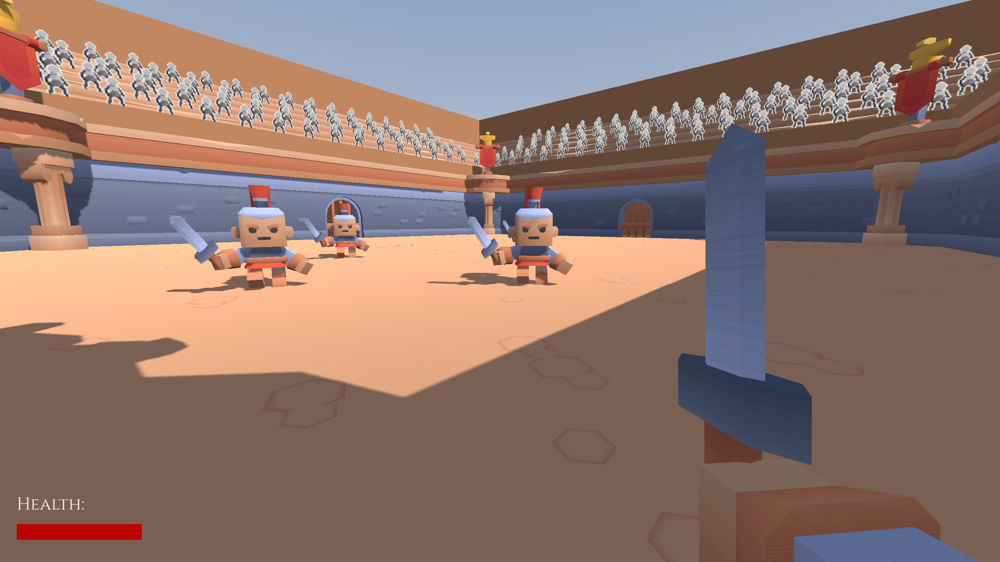
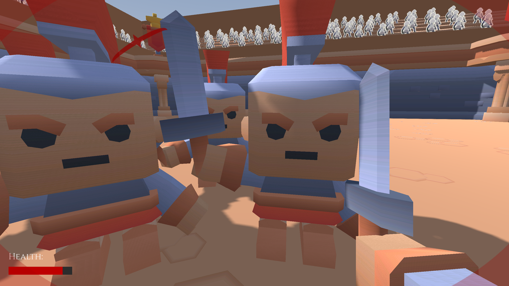
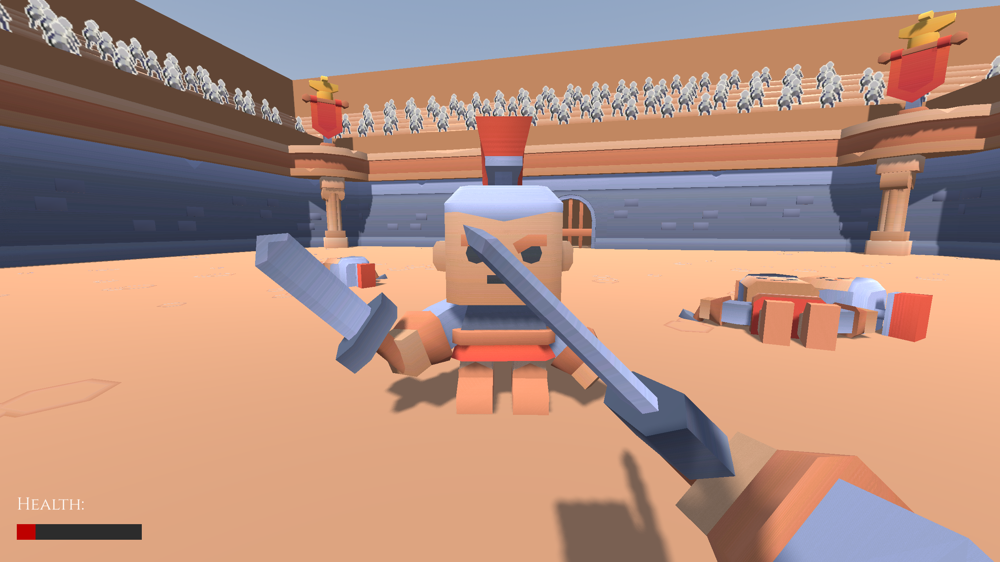

# Gladiator Battle Arena

Gladiator Battle Arena is a first-person arena simulator made in Godot
where the player must survive endless waves of gladiators.

# Controls

WASD to move.

SHIFT while running to sprint.

LMB to attack.

RMB to block.

LMB while blocking to shove enemies.

ESC to pause.

# Showcase

# Credits

See [Third Party Notice](THIRD_PARTY_NOTICE.md)
